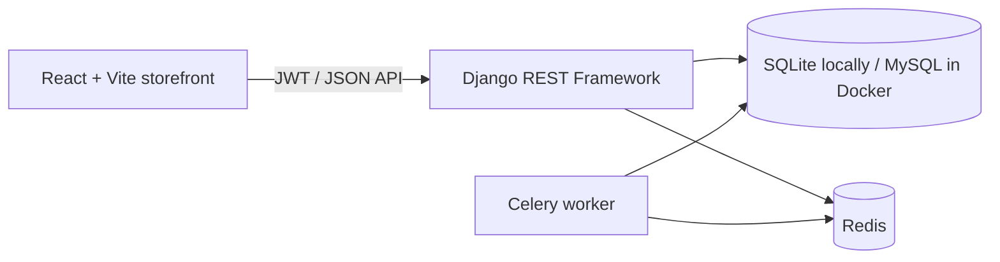

# NexusTicket

NexusTicket is a portfolio ticket-reservation application. It pairs a multilingual React storefront with a Django REST API for event discovery, JWT authentication, inventory-safe reservations, coupons, and a signed demo-payment flow.

> Status: portfolio-ready for local demonstration. See [the audit report](docs/AUDIT_REPORT.md) for verified results and known production limitations.

## What is included

- React 19 + Vite storefront with English, Persian (RTL), Turkish, and Russian UI copy.
- Django REST Framework API with OpenAPI/Swagger and ReDoc.
- JWT registration, login, and refresh endpoints.
- Atomic multi-ticket reservation, capacity checks, coupons, cancellation, and Celery-based expiry.
- A signed, one-time demo-payment page for the local checkout flow; it is not a real payment provider.
- Docker Compose development stack: Django, MySQL, Redis, and Celery.

## Architecture



Detailed architecture and endpoint notes are in [docs/ARCHITECTURE.md](docs/ARCHITECTURE.md) and [docs/API_VERIFICATION.md](docs/API_VERIFICATION.md).

## Prerequisites

- Python 3.11+ (the Docker image uses 3.11; the audit also passed on 3.13)
- Node.js 20+
- npm
- Docker Desktop, only for the optional Compose stack

## Local development

Create a private environment file; do not commit it.

```bash
cp .env.example .env
python3 -m venv .venv
source .venv/bin/activate
python -m pip install -r requirements.txt
python manage.py migrate
python manage.py createsuperuser
```

Start the API:

```bash
python manage.py runserver
```

In a second terminal, start the storefront:

```bash
cd frontend
cp .env.example .env.local
npm ci
npm run dev
```

The storefront uses its disclosed fictional inventory when `VITE_API_URL` is empty. To use the local API, set this in `frontend/.env.local` and restart Vite:

```env
VITE_API_URL=http://127.0.0.1:8000
VITE_CURRENCY=USD
```

The API does not ship with seeded public events. Create event records through `/admin/` after creating a superuser, or use the API as an authenticated organizer. This deliberate limitation avoids publishing a hard-coded account or misleading demo credentials.

## Docker development stack

Copy the example configuration first, then start the services:

```bash
cp .env.example .env
docker compose up --build
```

The API is available at `http://127.0.0.1:8011` unless `NEXUSTICKET_PORT` is changed. The compose file runs migrations on web-container startup. Create an administrator with:

```bash
docker compose exec web python manage.py createsuperuser
```

Docker Compose is a local-development stack. It intentionally does not claim to be a complete production deployment; configure a production WSGI/ASGI server, static/media storage, hosts, TLS termination, and observability before deployment.

## API quick reference

- Health: `GET /health/`
- Interactive documentation: `/api/docs/`
- OpenAPI schema: `/api/schema/`
- Authentication: `/api/auth/register/`, `/api/auth/login/`, `/api/auth/refresh/`
- Events: `/api/events/list/`, `/api/events/categories/`, `/api/events/tickets/`, `/api/events/reviews/`
- Reservations: `/api/orders/` and `/api/orders/{id}/cancel/`
- Payments: `/api/payments/request/`, `/api/payments/mock-bank/{authority_id}/`, `/api/payments/verify/`

Pass an access token as `Authorization: Bearer <access-token>` for protected endpoints. See [API verification](docs/API_VERIFICATION.md) for authentication, scenarios, and response behavior.

## Quality checks

From the repository root:

```bash
python3 manage.py check
python3 manage.py makemigrations --check --dry-run
python3 -m pytest -q
```

From `frontend/`:

```bash
npm run lint
npm run build
npm audit --omit=dev --audit-level=high
```

## Security notes

- `.env`, local SQLite databases, and Python cache files are ignored and removed from the repository index by this audit.
- If a secret was previously committed, removing the file does **not** erase Git history. Rotate affected keys and use GitHub secret scanning/history-rewrite guidance before making the repository public.
- Production requires a unique `SECRET_KEY` when `DEBUG=False`, explicit `ALLOWED_HOSTS`, CORS origins, CSRF trusted origins, TLS, and secure storage for media.
- JWTs are currently stored in browser local storage by the SPA. For a high-risk production application, move to a carefully designed secure-cookie/session model and add CSP plus rate limiting.

## Limitations and scope

- The demo payment page is intentionally simulated and must be replaced with a verified provider for real transactions.
- The storefront’s four languages cover interface copy and fictional local inventory. Live API event content is source-language only; multilingual CMS/API fields are not implemented.
- No public deployment configuration, error-reporting service, or frontend end-to-end test suite is included yet.

## License

No license is currently declared. Choose a license only after confirming the intended reuse and commercial terms.
