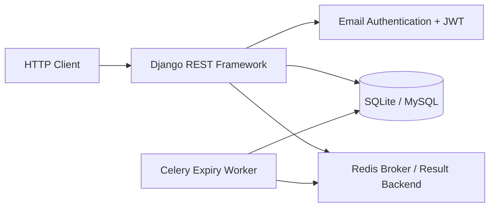

<div align="center">

# 🎟️ NexusTicket

### Event Ticketing REST API

<p>
  A Django REST API for event publishing, ticket reservations, inventory control, and demo payment workflows.
</p>

<p>
  <a href="https://github.com/sinajokarr/NexusTicket">
    
  </a>
  
  
  
</p>

<p>
  
  
  
</p>

<p>
  <a href="#-architecture">Architecture</a> ·
  <a href="#-api-map">API Map</a> ·
  <a href="#-quick-start">Quick Start</a> ·
  <a href="#-testing">Testing</a>
</p>

</div>

---

## ✨ Overview

NexusTicket is a backend-focused ticketing system. It covers the parts of ticket sales that require careful server-side handling: who can manage an event, who can reserve tickets, how inventory is protected, and how a pending reservation is released.

The API uses Django REST Framework with an email-based user model, JWT authentication, object-level access checks, transactional order handling, and a signed demo-payment flow. It exposes an OpenAPI schema together with Swagger UI and ReDoc for interactive exploration.

> [!NOTE]
> The payment workflow is a signed demo implementation for API testing. It is not connected to a real payment provider.

## 🧩 What the API handles

| Domain | Included behavior |
| :--- | :--- |
| **Accounts** | Email registration, JWT login, token refresh, Django admin access |
| **Events** | Artists, categories, events, ticket classes, search, ordering, and filters |
| **Access control** | Organizer/staff writes, user-scoped orders, purchaser-only review creation |
| **Reservations** | Single- or multi-line ticket reservations, capacity validation, coupon accounting |
| **Inventory** | Row locking during reservation; inventory restoration on cancellation or expiry |
| **Payments** | Signed, one-time demo-payment request and settlement flow |
| **API tooling** | Health endpoint, OpenAPI schema, Swagger UI, ReDoc, pytest suite |

## 🏗️ Architecture



<details>
<summary><strong>How reservations stay consistent</strong></summary>

<br>

1. A signed-in user submits one ticket line or a multi-ticket cart.
2. The API locks the relevant ticket classes and events inside a database transaction.
3. It validates the event status, date, capacity, and any coupon before creating the order.
4. It creates the order items and updates ticket inventory atomically.
5. A Celery task cancels a still-pending order after 15 minutes and returns inventory.

</details>

## 🛠️ Technology

<p>
  
  
  
  
  
  
  
  
</p>

| Layer | Implementation |
| :--- | :--- |
| **API** | Python, Django, Django REST Framework |
| **Authentication** | Custom email user model, Simple JWT, Django sessions |
| **Data** | SQLite locally; MySQL in Docker Compose |
| **Background work** | Celery with Redis broker and result backend |
| **Documentation** | drf-spectacular, Swagger UI, ReDoc |
| **Testing** | pytest-django, model-bakery, pytest-cov |
| **Automation** | GitHub Actions quality workflow |

## 🗂️ Project structure

```text
NexusTicket/
├── accounts/       Custom user model and registration endpoint
├── config/         Django settings, URLs, ASGI/WSGI, and Celery configuration
├── events/         Events, artists, categories, ticket classes, and reviews
├── orders/         Reservations, coupons, cancellation, and expiry task
├── payments/       Signed demo-payment request and verification endpoints
├── docs/           Architecture, API verification, and repository audit notes
├── docker-compose.yml
├── manage.py
└── requirements.txt
```

## 🧭 API map

Local server: `http://127.0.0.1:8000`<br>
Docker server: `http://127.0.0.1:8011`

| Area | Route | Access |
| :--- | :--- | :--- |
| Health | `GET /health/` | Public |
| API docs | `GET /api/schema/`, `/api/docs/`, `/api/redoc/` | Public |
| Authentication | `POST /api/auth/register/`, `/login/`, `/refresh/` | Public |
| Events | `/api/events/list/`, `/categories/`, `/tickets/`, `/reviews/` | Public reads; permission-controlled writes |
| Orders | `/api/orders/`, `/api/orders/{id}/cancel/` | Authenticated owner |
| Payments | `/api/payments/request/`, `/mock-bank/{authority_id}/`, `/verify/{authority_id}/` | Owner or signed demo session |

<details>
<summary><strong>Registration example</strong></summary>

<br>

```bash
curl -X POST http://127.0.0.1:8000/api/auth/register/ \
  -H 'Content-Type: application/json' \
  -d '{"email":"demo@example.com","password":"A-strong-demo-password-123"}'
```

Start the server, then visit [Swagger UI](http://127.0.0.1:8000/api/docs/) for the complete request and response contract.

</details>

## ⚡ Quick start

### Local development

**Prerequisites:** Python 3.11+ and `pip`. SQLite is the local default.

```bash
git clone https://github.com/sinajokarr/NexusTicket.git
cd NexusTicket

python3 -m venv .venv
source .venv/bin/activate
# Windows PowerShell: .venv\Scripts\Activate.ps1

python -m pip install --upgrade pip
python -m pip install -r requirements.txt
cp .env.example .env

python manage.py migrate
python manage.py runserver
```

Create an administrator when needed:

```bash
python manage.py createsuperuser
```

### Docker development stack

The Compose stack starts MySQL, Redis, Django, and Celery. The `web` service applies migrations before it starts Django’s development server.

```bash
cp .env.example .env
docker compose up --build
```

Open `http://127.0.0.1:8011/api/docs/` when the services are ready.

```bash
docker compose down
```

Use `docker compose down -v` only when you also want to remove the Compose-managed local MySQL volume.

## 🔐 Configuration and safeguards

<details>
<summary><strong>Environment variables</strong></summary>

<br>

Copy `.env.example` to `.env` for local overrides.

| Variable | Purpose | Local default |
| :--- | :--- | :--- |
| `DEBUG` | Django development mode | `True` |
| `SECRET_KEY` | Django signing key | Development-only placeholder |
| `DATABASE_URL` | Database connection string | SQLite `db.sqlite3` |
| `CELERY_BROKER_URL` | Celery broker | In-memory broker |
| `CELERY_RESULT_BACKEND` | Celery result backend | In-memory backend |
| `FRONTEND_BASE_URL` | Browser return URL for the demo-payment flow | `http://127.0.0.1:5173` |
| `PAYMENT_PUBLIC_BASE_URL` | Demo-payment base URL | `http://127.0.0.1:8011` |
| `CORS_ALLOWED_ORIGINS` | Permitted browser origins | Local development origin |

</details>

- Event and ticket-class writes are restricted to an organizer or staff member.
- Reviews require a paid order for the related event; anonymous users see approved reviews only.
- Order queries are scoped to the authenticated user.
- Reservations, cancellation, expiry, coupon accounting, and payment settlement use transactions.
- CORS uses an explicit allow-list rather than wildcard origins.
- When `DEBUG=False`, Django rejects the built-in development fallback secret.

## 🧪 Testing

```bash
python manage.py check
python manage.py makemigrations --check --dry-run
python -m pytest -q
```

The GitHub Actions quality workflow runs these backend checks on pushes and pull requests.

## 📌 Scope

- The payment endpoints are a signed demo implementation, not a real payment-provider integration.
- Docker Compose is intended for local development. It does not provide a production reverse proxy, static/media storage, monitoring, or rate limiting.
- No license file is currently included.

---

<div align="center">

Built as a backend portfolio project focused on API design, authorization, and transactional ticket inventory.

<a href="https://github.com/sinajokarr/NexusTicket">View the repository</a>

</div>
