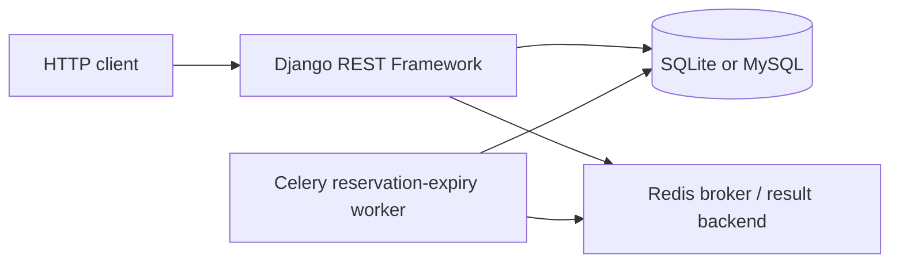

# NexusTicket

NexusTicket is a Django REST API for managing events, ticket classes, reservations, coupons, reviews, and a demo payment workflow. It is designed around the backend concerns of a ticketing system: access control, inventory consistency, order ownership, and documented HTTP endpoints.

## Features

- Email-based user registration with JWT login and token refresh endpoints.
- Public browsing of active events, categories, ticket classes, and approved reviews.
- Organizer- and staff-controlled event and ticket-class management.
- Event search, ordering, and filters for location, activity status, date range, and ticket-price range.
- Atomic single- or multi-ticket reservations with database locks to protect capacity.
- Coupon validation and usage accounting within the reservation transaction.
- Order cancellation and a Celery task that releases pending reservations after 15 minutes.
- Purchaser-only reviews, with approval-aware public visibility.
- Signed, one-time demo-payment flow for testing settlement behavior without a payment provider.
- OpenAPI schema, Swagger UI, ReDoc, Django admin, health check, tests, and a Docker development stack.

## Technology

| Area | Tools |
| --- | --- |
| API | Python, Django, Django REST Framework |
| Authentication | Custom email user model, Simple JWT, Django sessions |
| Database | SQLite for local development; MySQL with Docker Compose |
| Background tasks | Celery and Redis |
| API documentation | drf-spectacular, Swagger UI, ReDoc |
| Testing | pytest-django, model-bakery, pytest-cov |
| Automation | GitHub Actions |

## Architecture



- `accounts` owns email-based authentication.
- `events` contains artists, categories, events, ticket classes, and reviews.
- `orders` creates reservations, applies coupons, and manages cancellation/expiry.
- `payments` implements the signed demo-payment request and verification flow.

For implementation detail, see [docs/ARCHITECTURE.md](docs/ARCHITECTURE.md).

## Project structure

```text
.
├── accounts/       custom user model and registration endpoint
├── config/         Django, Celery, URL, and runtime configuration
├── events/         event, artist, category, ticket-class, and review API
├── orders/         reservations, coupons, cancellation, and expiry task
├── payments/       signed demo-payment endpoints
├── docs/           architecture and API verification notes
├── docker-compose.yml
├── manage.py
└── requirements.txt
```

## API overview

The local server uses `http://127.0.0.1:8000` by default. Docker exposes the API at `http://127.0.0.1:8011` unless `NEXUSTICKET_PORT` is changed.

| Area | Endpoint | Access |
| --- | --- | --- |
| Service health | `GET /health/` | Public |
| API schema | `GET /api/schema/` | Public |
| Interactive documentation | `GET /api/docs/`, `/api/redoc/` | Public |
| Authentication | `POST /api/auth/register/`, `/login/`, `/refresh/` | Public |
| Events | `/api/events/list/`, `/categories/`, `/tickets/`, `/reviews/` | Public reads; permission-controlled writes |
| Orders | `/api/orders/`, `/api/orders/{id}/cancel/` | Authenticated owner |
| Payments | `/api/payments/request/`, `/mock-bank/{authority_id}/`, `/verify/{authority_id}/` | Owner or signed demo-payment session, as applicable |

Example registration request:

```bash
curl -X POST http://127.0.0.1:8000/api/auth/register/ \
  -H 'Content-Type: application/json' \
  -d '{"email":"demo@example.com","password":"A-strong-demo-password-123"}'
```

Start the server and open [Swagger UI](http://127.0.0.1:8000/api/docs/) for the complete API contract. The verification matrix is in [docs/API_VERIFICATION.md](docs/API_VERIFICATION.md).

## Local setup

### Prerequisites

- Python 3.11 or later
- `pip`

SQLite is the default local database. MySQL, Redis, and Celery are required only for the Docker stack or asynchronous reservation expiry.

```bash
git clone https://github.com/sinajokarr/NexusTicket.git
cd NexusTicket

python3 -m venv .venv
source .venv/bin/activate
# Windows PowerShell: .venv\Scripts\Activate.ps1

python -m pip install --upgrade pip
python -m pip install -r requirements.txt
cp .env.example .env

python manage.py migrate
python manage.py runserver
```

Create an administrator when needed:

```bash
python manage.py createsuperuser
```

## Configuration

Copy `.env.example` to `.env` for local overrides.

| Variable | Purpose | Local default |
| --- | --- | --- |
| `DEBUG` | Enables Django development mode | `True` |
| `SECRET_KEY` | Django signing key | Development-only placeholder in `.env.example` |
| `DATABASE_URL` | Database connection string | SQLite `db.sqlite3` |
| `CELERY_BROKER_URL` | Celery broker | In-memory broker |
| `CELERY_RESULT_BACKEND` | Celery result backend | In-memory backend |
| `FRONTEND_BASE_URL` | Browser return URL for the demo-payment flow | `http://127.0.0.1:5173` |
| `PAYMENT_PUBLIC_BASE_URL` | Public base URL for the demo-payment page | `http://127.0.0.1:8011` |
| `CORS_ALLOWED_ORIGINS` | Comma-separated permitted browser origins | Local development origin |

Use a unique `SECRET_KEY` and explicit host/origin settings outside local development. The application rejects its development fallback secret when `DEBUG=False`.

## Docker development stack

Docker Compose starts MySQL, Redis, Django, and Celery. The `web` service applies migrations before it starts Django’s development server.

```bash
cp .env.example .env
docker compose up --build
```

The API documentation is then available at `http://127.0.0.1:8011/api/docs/`.

```bash
docker compose down
```

To remove the Compose-managed MySQL volume too, use `docker compose down -v`.

## Testing and checks

Run these commands from the repository root:

```bash
python manage.py check
python manage.py makemigrations --check --dry-run
python -m pytest -q
```

The GitHub Actions quality workflow runs the Django checks, migration check, and test suite on pushes and pull requests.

## Access control and data integrity

- Event and ticket-class writes are restricted to the organizer or staff member.
- Review creation requires a paid order for the reviewed event; anonymous users see approved reviews only.
- Order list and detail queries are scoped to the authenticated user.
- Reservation creation locks the relevant ticket classes and events before decrementing availability.
- Cancellation and expiry restore ticket inventory and coupon usage within database transactions.
- CORS uses an explicit allow-list rather than wildcard origins.

## Scope and limitations

- The payment endpoints are a signed demo flow, not a real payment-provider integration.
- Docker Compose is for local development; it runs Django’s development server and does not provide a reverse proxy, production static/media storage, monitoring, or rate limiting.
- No license file is currently included.

## Suggested GitHub metadata

- **Description:** Django REST API for event ticket reservations with atomic inventory handling and demo payments.
- **Topics:** `django`, `django-rest-framework`, `python`, `rest-api`, `jwt`, `celery`, `redis`, `mysql`, `ticketing`
