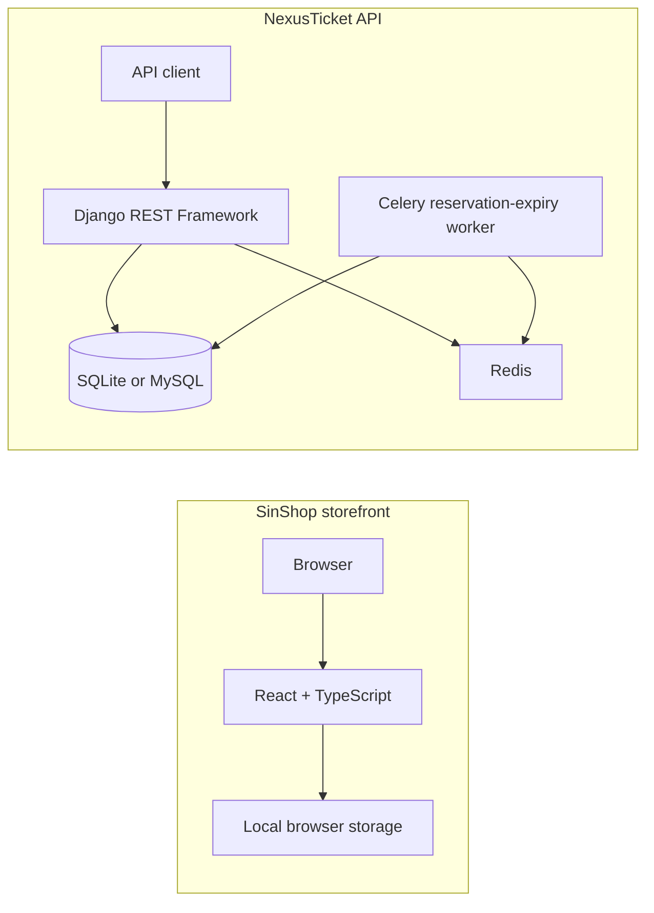

# NexusTicket

NexusTicket is a Django REST API for publishing events, reserving ticket inventory, and completing a signed demo-payment flow. The same repository also contains **SinShop**, a standalone React storefront used as an interactive portfolio demo for active-lifestyle products.

The two applications are intentionally independent in the current version. SinShop uses fictional catalog data and browser storage; it does not call the Django API. The backend remains runnable and documented as a ticketing API sample.

## Repository at a glance

| Component | Purpose | Run location |
| --- | --- | --- |
| Django API | Event management, ticket reservations, orders, coupons, and demo payments | Repository root |
| SinShop storefront | Multilingual product-browsing and simulated checkout experience | `frontend/` |
| Docker Compose | Local MySQL, Redis, Django, and Celery environment for the API | Repository root |

## Highlights

### Django ticketing API

- Email-based registration with JWT access and refresh endpoints.
- Public browsing of active events, categories, ticket classes, and approved reviews.
- Organizer and staff permissions for event and ticket-class management.
- Event search, ordering, and filters for location, date range, active state, and ticket-price range.
- Atomic, multi-line ticket reservations using database locks to protect ticket capacity and coupon usage.
- Pending-order cancellation and a Celery task that releases a reservation after 15 minutes.
- A signed, one-time demo-payment page. It models the handoff and settlement flow but is not a payment-provider integration.
- OpenAPI schema, Swagger UI, ReDoc, a health endpoint, and a Django admin site.

### SinShop storefront

- A local catalog of 24 fictional active-lifestyle products across training, running, yoga, recovery, smart-health, and outdoor categories.
- English, Persian (RTL), Turkish, and Russian interfaces, with locale-aware routes.
- Product search, category browsing, sorting, availability and price filters, product variants, cart, and wishlist.
- Simulated account and checkout screens; no actual account or payment data is submitted.
- Cart, wishlist, and language preference stored only in the browser via `localStorage`.
- A custom client-side router that supports GitHub Pages project paths and direct-link fallback deployment.

## Technology

| Area | Tools |
| --- | --- |
| API | Python, Django, Django REST Framework |
| Authentication | Custom email user model, Simple JWT, Django sessions |
| Data and async work | SQLite for local development; MySQL, Redis, and Celery in Docker |
| API documentation | drf-spectacular, Swagger UI, ReDoc |
| Storefront | React, TypeScript, Vite, Lucide React |
| Testing | pytest-django, model-bakery, Vitest |
| Automation | GitHub Actions |

## Architecture



The diagram shows the two executable parts of this repository, not a live integration between them. See [the architecture notes](docs/ARCHITECTURE.md) for implementation details and boundaries.

## Project structure

```text
.
├── accounts/       email-based user registration
├── config/         Django, Celery, URL, and runtime configuration
├── events/         event, artist, category, ticket-class, and review API
├── orders/         reservation, coupon, cancellation, and expiry logic
├── payments/       signed demo-payment endpoints
├── frontend/       SinShop React/Vite portfolio storefront
├── docs/           architecture, API verification, and audit notes
├── docker-compose.yml
└── requirements.txt
```

## API overview

The local Django server runs at `http://127.0.0.1:8000` by default. Docker exposes it at `http://127.0.0.1:8011` unless `NEXUSTICKET_PORT` is changed.

| Area | Endpoint | Access |
| --- | --- | --- |
| Service health | `GET /health/` | Public |
| Schema and UI | `GET /api/schema/`, `/api/docs/`, `/api/redoc/` | Public |
| Authentication | `POST /api/auth/register/`, `/login/`, `/refresh/` | Public |
| Events | `/api/events/list/`, `/categories/`, `/tickets/`, `/reviews/` | Read public; writes are permission-controlled |
| Orders | `/api/orders/`, `/api/orders/{id}/cancel/` | Authenticated owner |
| Payments | `/api/payments/request/`, `/mock-bank/{authority_id}/`, `/verify/{authority_id}/` | Owner or signed demo-payment session, as applicable |

Example registration request:

```bash
curl -X POST http://127.0.0.1:8000/api/auth/register/ \
  -H 'Content-Type: application/json' \
  -d '{"email":"demo@example.com","password":"A-strong-demo-password-123"}'
```

For the complete request and response shapes, start the API and open [Swagger UI](http://127.0.0.1:8000/api/docs/). The recorded backend verification matrix is in [docs/API_VERIFICATION.md](docs/API_VERIFICATION.md).

## Run the Django API locally

### Prerequisites

- Python 3.11 or later
- `pip`

SQLite is the default local database. MySQL, Redis, and Celery are only required for the Docker stack or asynchronous reservation expiry.

```bash
git clone https://github.com/sinajokarr/NexusTicket.git
cd NexusTicket

python3 -m venv .venv
source .venv/bin/activate
# Windows PowerShell: .venv\Scripts\Activate.ps1

python -m pip install --upgrade pip
python -m pip install -r requirements.txt
cp .env.example .env

python manage.py migrate
python manage.py runserver
```

The API will be available at `http://127.0.0.1:8000`. Create an administrator when needed:

```bash
python manage.py createsuperuser
```

### Configuration

Copy `.env.example` to `.env` for local overrides. The most relevant variables are:

| Variable | Purpose | Local default |
| --- | --- | --- |
| `DEBUG` | Enables Django development mode | `True` |
| `SECRET_KEY` | Django signing key | Development-only placeholder in `.env.example` |
| `DATABASE_URL` | Database connection string | SQLite `db.sqlite3` |
| `CELERY_BROKER_URL` | Celery broker | In-memory broker |
| `CELERY_RESULT_BACKEND` | Celery results backend | In-memory backend |
| `FRONTEND_BASE_URL` | Return URL used by the demo-payment flow | `http://127.0.0.1:5173` |
| `PAYMENT_PUBLIC_BASE_URL` | Public base URL for the demo-payment page | `http://127.0.0.1:8011` |
| `CORS_ALLOWED_ORIGINS` | Comma-separated permitted browser origins | Vite local origin |

Use a unique `SECRET_KEY` and explicit host/origin settings outside local development. The application rejects the built-in development fallback when `DEBUG=False`.

## Run the frontend locally

### Prerequisites

- Node.js 20 or later
- npm

```bash
cd frontend
npm ci
npm run dev
```

Vite prints the local URL, normally `http://127.0.0.1:5173`.

No environment variables are required for local storefront development. `VITE_BASE_PATH` is optional and is set by the GitHub Pages workflow to build the app beneath the repository path.

## Docker API environment

Docker Compose starts MySQL, Redis, Django, and the Celery worker. The `web` service applies migrations before it starts Django’s development server.

```bash
cp .env.example .env
docker compose up --build
```

Open `http://127.0.0.1:8011/api/docs/` when the services are ready. To stop the stack:

```bash
docker compose down
```

To remove the local MySQL volume as well, use `docker compose down -v`. This deletes only the Compose-managed local database volume.

## Verification

Run the backend checks from the repository root:

```bash
python manage.py check
python manage.py makemigrations --check --dry-run
python -m pytest -q
```

Run the storefront checks from `frontend/`:

```bash
npm run lint
npm run test
npm run build
```

GitHub Actions includes a quality workflow for Django checks, migrations, backend tests, TypeScript checking, and a storefront build. The Pages workflow also runs the frontend unit tests before deploying the static storefront on pushes to `main`.

## Data access and payment boundaries

- Event edits and ticket-class management are limited to an event organizer or staff member.
- Reviews are public only after approval; creating one requires a paid order for the related event.
- Order list and detail queries are scoped to the authenticated owner.
- Reservation, cancellation, expiry, coupon accounting, and payment settlement use transactions; reservation creation locks the affected rows.
- CORS uses an explicit allow-list rather than wildcard origins.
- The payment pages are a signed demo flow. They must be replaced with provider-side verification before handling real payments.

## Deployment notes

The `frontend` app can be published with the included GitHub Pages workflow. In the GitHub repository, set **Settings → Pages → Source** to **GitHub Actions**, then push to `main`.

The Docker configuration is for local development, not a production deployment. It runs Django’s development server and does not include a reverse proxy, managed static/media storage, monitoring, rate limiting, or a real payment provider.

## License

No license file is included. Usage and redistribution terms have not been declared.

## Suggested GitHub metadata

- **Description:** Django ticket-reservation API with atomic inventory handling and a standalone React storefront demo.
- **Topics:** `django`, `django-rest-framework`, `react`, `typescript`, `vite`, `celery`, `redis`, `mysql`, `rest-api`, `portfolio-project`
