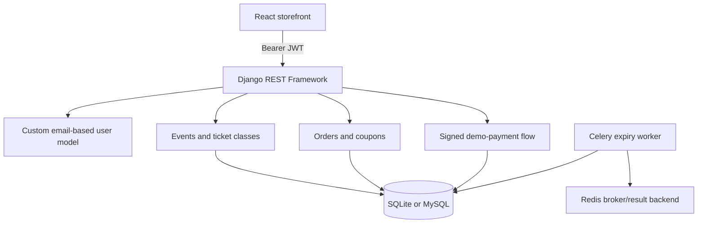

# Architecture

## System overview

NexusTicket is a two-application repository. `frontend/` is a browser-rendered React/Vite application. The repository root is a Django REST Framework API. They communicate through JSON over a configurable `VITE_API_URL` base URL.

## Backend

- Entry points: `manage.py`, `config/asgi.py`, and `config/wsgi.py`.
- Configuration: `config/settings.py`, using `django-environ`. SQLite is the safe local default; Docker sets MySQL and Redis URLs.
- API: DRF `ModelViewSet`s for events, ticket classes, categories, and reviews; a restricted order viewset; and explicit payment views.
- Authentication: email-based custom user model and Simple JWT access/refresh tokens. Global default is `IsAuthenticatedOrReadOnly`.
- Inventory: `OrderCreateSerializer` locks ticket classes and associated events in a transaction before reserving capacity. Cancellation/expiry also lock affected rows before restoring inventory.
- Payments: the gateway is a signed, one-time demo flow. It must not be presented as a real acquirer integration.

## Frontend

- Entry: `frontend/src/main.tsx`; routes are declared in `frontend/src/App.tsx` using the small in-repo client router.
- API client: `frontend/src/lib/api.ts`; it normalizes DRF event payloads, adds Bearer tokens, and serializes token refreshes to avoid duplicate refresh requests.
- UI state: `AppContext` stores cart and favorites per auth scope in local storage. The API remains the authority for final prices, capacity, coupons, orders, and payment state.
- Internationalization: `LanguageProvider` contains English, Persian, Russian, and Turkish interface copy; it writes `lang` and `dir` to the document. Persian uses RTL. Live API event data itself has no translated fields.
- Offline/demo behavior: with no `VITE_API_URL`, the UI deliberately uses explicitly documented fictional data and a local demo checkout. With an API URL configured, event, order, auth, and payment calls use the backend.

## Deployment structure

`docker-compose.yml` is a local development orchestration file for MySQL, Redis, Django, and Celery. It is not a complete production deployment: it uses Django’s development server and has no reverse proxy, static/media storage service, or application monitoring. Production settings enforce a unique `SECRET_KEY` when `DEBUG=False`, HTTPS redirects by default, secure cookies, HSTS, `X-Frame-Options: DENY`, and a restrictive referrer policy.

## Key decisions

- Preserve stock at the API boundary with database locks rather than trusting cart values from the client.
- Preserve legacy single-ticket order input while allowing atomic multi-line reservations.
- Keep public event browsing unauthenticated while restricting organizers, reviews, orders, and payment initiation.
- Keep no real secrets or demo credentials in source control.
