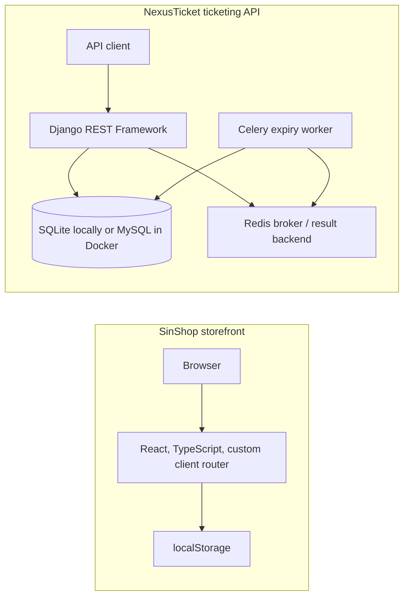

# Architecture

## Repository boundary

NexusTicket contains two independently executable applications:

1. The repository root is a Django REST Framework API for ticketing workflows.
2. `frontend/` is the SinShop React/Vite storefront portfolio demo.

The current SinShop implementation is intentionally self-contained. It reads its fictional product catalog from `frontend/src/data/catalog.ts` and persists cart, wishlist, and language preference in browser storage. It does **not** call the Django API. The API and storefront should therefore be run and evaluated as separate application samples.

## Backend

- **Entry points:** `manage.py`, `config/asgi.py`, and `config/wsgi.py`.
- **Configuration:** `config/settings.py` uses `django-environ`. SQLite is the local default; Docker supplies MySQL and Redis connection URLs.
- **Authentication:** `accounts.User` uses email as its login identifier. Django REST Framework accepts JWT bearer tokens and sessions; its default permission is `IsAuthenticatedOrReadOnly`.
- **Events:** the `events` app exposes category, event, ticket-class, and review viewsets. Event queries use `select_related` and `prefetch_related`; searches, ordering, and filters are configured on the event viewset.
- **Inventory:** order creation locks ticket classes and events within a transaction before it reserves capacity. Cancellation locks and restores the same inventory. Celery cancels pending orders after 15 minutes and releases their inventory.
- **Payments:** the `payments` app provides a signed, single-use demo payment session. It is deliberately not a real payment-acquirer integration.
- **Documentation:** the API exposes an OpenAPI schema at `/api/schema/`, Swagger UI at `/api/docs/`, and ReDoc at `/api/redoc/`.

## Frontend

- **Entry and routes:** `frontend/src/main.tsx` loads `App.tsx`, which declares locale-aware routes through the small in-repo router.
- **Catalog and state:** 24 fictional products are stored in `data/catalog.ts`. `ShopContext` persists the cart and wishlist under `sinshop-cart` and `sinshop-wishlist`; `LanguageProvider` persists the locale under `sinshop-locale`.
- **Internationalization:** English, Persian, Turkish, and Russian UI copy is defined locally. Persian changes the document direction to RTL.
- **Deployment:** the Vite base path comes from `VITE_BASE_PATH`. The Pages workflow sets it for a project site and copies `index.html` to `404.html` to support direct links.

## Development deployment boundary

`docker-compose.yml` is a local development configuration for MySQL, Redis, Django, and Celery. It runs `python manage.py runserver`; it does not supply a reverse proxy, production static/media storage, monitoring, rate limiting, or a real payment provider.

When `DEBUG=False`, Django requires a non-default `SECRET_KEY`, enables HTTPS redirects by default, sets secure cookies, and configures HSTS, `X-Frame-Options: DENY`, and a restrictive referrer policy. These controls do not make the development Compose stack a production deployment.
