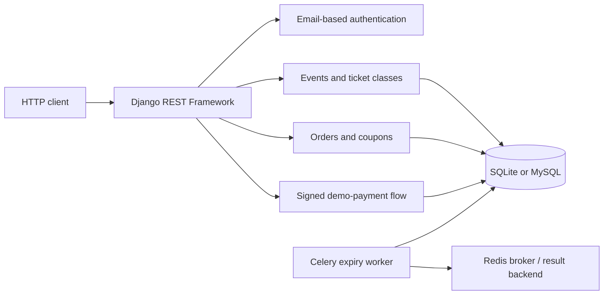

# Architecture

## Overview

NexusTicket is a Django REST Framework API for ticketing workflows. The system models users, event publishing, ticket classes, ticket reservations, coupons, reviews, and a demo payment process.

## Backend modules

- **Configuration:** `config/settings.py` uses `django-environ`. SQLite is the local default; Docker supplies MySQL and Redis connection URLs.
- **Accounts:** `accounts.User` uses email as its login identifier. Django REST Framework accepts JWT bearer tokens and Django sessions; its global default permission is `IsAuthenticatedOrReadOnly`.
- **Events:** `events` exposes category, event, ticket-class, and review viewsets. Event queries use `select_related` and `prefetch_related`; searching, ordering, and filters are configured on the event viewset.
- **Orders:** `orders` supports the legacy single-line input and multi-line reservations. It locks ticket classes and events inside a transaction, computes coupon discounts, and creates order items before incrementing sold inventory.
- **Reservation expiry:** successful reservation creation schedules `expire_order_task` with a 15-minute countdown. The task cancels pending orders and releases ticket/coupon usage.
- **Payments:** `payments` creates a pending payment for an order, presents a signed one-time demo page, and permits settlement only through a signed or authorized POST request. It is not a real payment-acquirer integration.
- **Documentation:** `/api/schema/` publishes OpenAPI, with Swagger UI at `/api/docs/` and ReDoc at `/api/redoc/`.

## Local development boundary

`docker-compose.yml` is a local development configuration for MySQL, Redis, Django, and Celery. It starts Django with `runserver` and does not provide a production reverse proxy, production static/media storage, monitoring, rate limiting, or a real payment provider.

When `DEBUG=False`, Django requires a non-default `SECRET_KEY`, enables HTTPS redirects by default, sets secure cookies, and configures HSTS, `X-Frame-Options: DENY`, and a restrictive referrer policy. These controls do not make the development Compose stack a production deployment.
